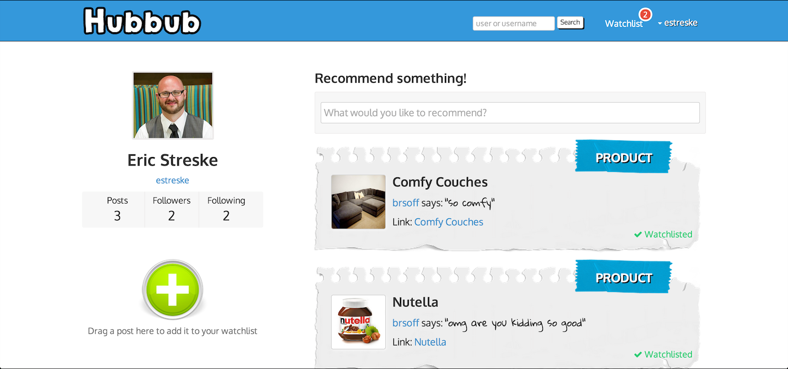

#Hubbub

Hubbub is a social media app that allows user to post their recommendations for their favorite restaurants, bars, food, articles, etc.  Users can follow others, watchlist their favorite items, and find cool stuff!




##Technologies Used

- Rails 4
- Font-Awesome
- Bootstrap
- CarrierWave
- Fog
- Backbone.js
- Underscore.js
- jQuery
- jQuery UI
- Devise


##Code Snippets
This is the Backbone code used to make posts draggable into the user's watchlist.

```
if (this.model.attributes.user_id != Hubbub.currentuser.attributes.user_id) {

      this.$el.attr("draggable", "true")
      this.$el.draggable({
      cursor: "pointer",
        stack: "trash",
        helper: "clone",
        container: "document",
        appendTo: 'body',
        revert: 'invalid',
        opacity: .7
      });
      $("#add_watchlist").droppable({
        accept: ".eachpost",
        hoverClass: "add_watchlist-hover",
        drop: function (event, ui) {
          self.doStopStuff(event, ui)
          console.log("stuff")
        }
      });

    }

  },

  doStopStuff: function (e, draggable) {
    e.preventDefault();
    var object = draggable.draggable.data();

    console.log("stuff happened")

        var new_watchlist = new Watchlist(object);

        var params = { post_id: object.attributes.id }

        // draggable.draggable.fadeOut(300);

        $.ajax({
          url: "/watchlists",
          data: params,
          method: "post",
          dataType: "json",
          success: function (data) {
            console.log(data)
            Hubbub.currentuserwatchlists.fetch({
              success: function () {
                $('#posts').empty().html(Hubbub.currentuserpostsView.render().el);
                Hubbub.currentuserpostsView.delegateEvents();
              }
            });


          }
        })

  },
```

##URL

http://the-hubbub.herokuapp.com

##Contact

For any additional information or suggestions, please contact any one of the below contributors:

Eric Streske - estreske@gmail.com

Brendan Soffientini - brsoff@gmail.com 